# 🚀 Flask Application on AWS EKS with Complete CI/CD Pipeline

A production-ready deployment of a Python Flask application to Amazon EKS (Elastic Kubernetes Service) using Infrastructure as Code, containerization, and continuous integration/deployment best practices.

---

## 📋 Table of Contents

- [Project Overview](#project-overview)
- [Architecture](#architecture)
- [Technology Stack](#technology-stack)
- [Prerequisites](#prerequisites)
- [Quick Start](#quick-start)
- [Step-by-Step Deployment](#step-by-step-deployment)
  - [Step 1: Test Python Application](#step-1-test-python-application)
  - [Step 2: Terraform Init](#step-2-terraform-init)
  - [Step 3: Terraform Plan](#step-3-terraform-plan)
  - [Step 4: Terraform Apply](#step-4-terraform-apply)
  - [Step 5: Docker Build](#step-5-docker-build)
  - [Step 6: Verify ECR Repository](#step-6-verify-ecr-repository)
  - [Step 7: Docker Push](#step-7-docker-push)
  - [Step 8: Test Application Endpoint](#step-8-test-application-endpoint)
  - [Step 9: Verify Kubernetes Deployment](#step-9-verify-kubernetes-deployment)
- [Application Details](#application-details)
- [Access & Testing](#access--testing)
- [Jenkins CI/CD Pipeline Setup](#jenkins-cicd-pipeline-setup)
- [Troubleshooting](#troubleshooting)
- [Cleanup](#cleanup)

---

## 📖 Project Overview

This project demonstrates a complete modern DevOps workflow for deploying a containerized Flask application to AWS EKS. It includes:

- **Infrastructure as Code**: Terraform-managed AWS resources (VPC, EKS, ECR)
- **Containerization**: Docker image with multi-stage builds and security best practices
- **Kubernetes Deployment**: Production-ready manifests with health checks and resource management
- **CI/CD Pipeline**: Jenkins automation for build, test, push, and deploy
- **Load Balancing**: AWS Network Load Balancer for high availability

---

## 🏗️ Architecture

### AWS Infrastructure
- **VPC**: Custom VPC with public subnets across 2 availability zones
- **EKS Cluster**: Kubernetes 1.29 with managed node groups (<CLUSTER_NAME>)
- **ECR**: Elastic Container Registry for Docker images (flask-app)
- **LoadBalancer**: AWS Network Load Balancer for external access

### Kubernetes Components
- **Namespace**: `flask-eks` - Isolated application environment
- **Deployment**: 2 replicas of Flask pods for high availability
- **Service**: LoadBalancer type service exposing port 80
- **Health Checks**: Liveness and readiness probes on `/healthz` endpoint

### Deployment Architecture
```
┌─────────────────────────────────────────┐
│         AWS EKS Cluster                 │
│  ┌──────────────────────────────────┐  │
│  │   Namespace: flask-eks           │  │
│  │  ┌────────────────────────────┐  │  │
│  │  │  Deployment (2 replicas)   │  │  │
│  │  │  ├─ Pod 1: flask-eks-app   │  │  │
│  │  │  └─ Pod 2: flask-eks-app   │  │  │
│  │  └────────────────────────────┘  │  │
│  │  ┌────────────────────────────┐  │  │
│  │  │  Service (LoadBalancer)    │  │  │
│  │  │  Port 80 → 8080            │  │  │
│  │  └────────────────────────────┘  │  │
│  └──────────────────────────────────┘  │
└─────────────────────────────────────────┘
         ↓
    AWS ELB (Port 80)
         ↓
    Internet Users
```

---

## 💻 Technology Stack

| Component | Version | Purpose |
|-----------|---------|---------|
| **AWS** | Latest | Cloud infrastructure |
| **Terraform** | >= 1.6.0 | Infrastructure as Code |
| **EKS** | 1.29 | Kubernetes service |
| **Docker** | Latest | Container runtime |
| **Python** | 3.11 | Application runtime |
| **Flask** | 3.0.0 | Web framework |
| **Gunicorn** | 21.2.0 | WSGI application server |
| **Jenkins** | Latest | CI/CD automation |
| **kubectl** | 1.29+ | Kubernetes CLI |

---

## 📋 Prerequisites

### AWS Account Requirements
- ✅ AWS Account with appropriate IAM permissions
- ✅ Access to create: VPC, EKS, ECR, IAM roles
- ✅ AWS CLI v2 installed and configured
- ✅ AWS credentials configured: `aws configure`

### Local Machine Requirements
- ✅ **Terraform**: v1.6.0 or higher
  ```powershell
  terraform --version
  ```
- ✅ **Docker**: Latest version
  ```powershell
  docker --version
  ```
- ✅ **kubectl**: v1.29 or higher
  ```powershell
  kubectl version --client
  ```
- ✅ **Python**: 3.11 or higher (for local testing)
  ```powershell
  python --version
  ```

### AWS Credentials
Ensure your AWS credentials are properly configured:
```powershell
aws sts get-caller-identity
```

Should return your Account ID and User ARN.

---

## 🚀 Quick Start

### Automated Deployment (Recommended)

```powershell
# 1. Clone and navigate to project
cd e:\flask-eks-cicd

# 2. Deploy infrastructure with Terraform
cd infra\terraform
terraform init
terraform plan -out tfplan
terraform apply tfplan

# 3. Build and push Docker image
cd ..\..\
docker build -t flask-app:v1 .
aws ecr get-login-password --region <REGION> | docker login --username AWS --password-stdin <ACCOUNT_ID>.dkr.ecr.<REGION>.amazonaws.com
docker tag flask-app:v1 <ACCOUNT_ID>.dkr.ecr.<REGION>.amazonaws.com/flask-app:v1
docker push <ACCOUNT_ID>.dkr.ecr.<REGION>.amazonaws.com/flask-app:v1

# 4. Configure kubectl and deploy
aws eks update-kubeconfig --region <REGION> --name <CLUSTER_NAME>
kubectl apply -f k8s/namespace.yaml
(Get-Content k8s/deployment.yaml) -replace '<tag>', 'v1' | kubectl apply -f -
kubectl apply -f k8s/service.yaml

# 5. Get service endpoint
kubectl -n flask-eks get svc flask-eks-service
```

---

## 📝 Step-by-Step Deployment

### Step 1: Test Python Application

First, let's test the Flask application locally to ensure it works correctly.

```powershell
# Navigate to project directory
cd e:\flask-eks-cicd

# Create virtual environment
python -m venv .venv

# Activate virtual environment
.\.venv\Scripts\Activate.ps1

# Install dependencies
pip install -r app\requirements.txt

# Run Flask application
python app\main.py

# Test endpoints (in another terminal)
Invoke-WebRequest -Uri http://localhost:8080/ -UseBasicParsing
Invoke-WebRequest -Uri http://localhost:8080/healthz -UseBasicParsing
```

**Expected Output:**

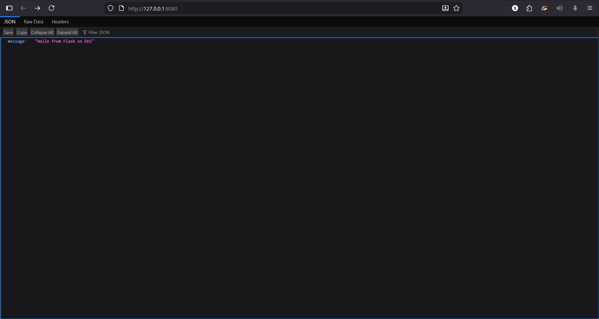

The application should respond with:
- `/` → `{"message":"Hello from Flask on EKS"}`
- `/healthz` → `{"status":"ok"}`

---

### Step 2: Terraform Init

Initialize Terraform to download required providers and modules.

```powershell
cd e:\flask-eks-cicd\infra\terraform

# Initialize Terraform
terraform init

# This downloads:
# - AWS Provider (~5.95)
# - EKS Module (~20.37)
# - VPC Module (~5.1)
```

**Expected Output:**

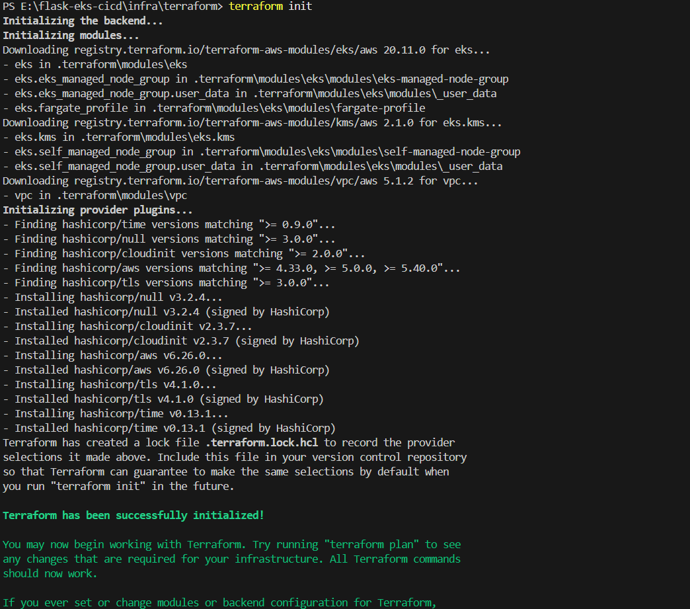

The output should show:
```
Terraform has been successfully initialized!
```

---

### Step 3: Terraform Plan

Review the infrastructure changes before applying them.

```powershell
cd e:\flask-eks-cicd\infra\terraform

# Create execution plan
terraform plan -out tfplan

# This will show:
# - VPC with public subnets in <REGION>a and <REGION>b
# - EKS cluster (<CLUSTER_NAME>)
# - Managed node groups (2 x t3.medium)
# - ECR repository (flask-app)
# - IAM roles and security groups
```

**Expected Output:**

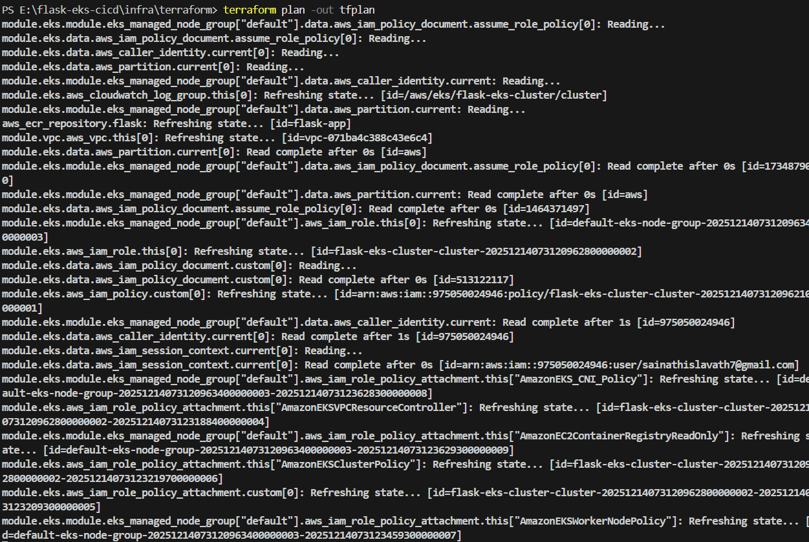

The output should end with:
```
Plan: X to add, 0 to change, 0 to destroy.
```

---

### Step 4: Terraform Apply

Apply the infrastructure changes to AWS.

```powershell
cd e:\flask-eks-cicd\infra\terraform

# Apply the plan
terraform apply tfplan

# This will take approximately 10-15 minutes to:
# - Create VPC and subnets
# - Create EKS cluster
# - Provision worker nodes
# - Create ECR repository
```

**Expected Output:**

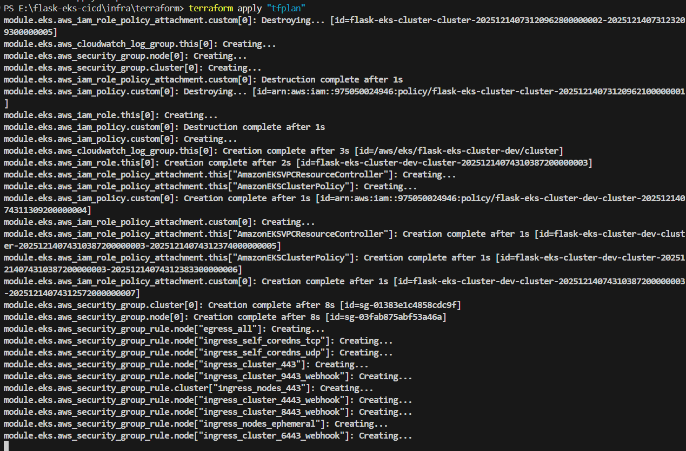

The output should show:
```
Apply complete! Resources: X added, 0 changed, 0 destroyed.

Outputs:
cluster_name = "<CLUSTER_NAME>"
ecr_url = "<ACCOUNT_ID>.dkr.ecr.<REGION>.amazonaws.com/flask-app"
```

---

### Step 5: Docker Build

Build the Flask application Docker image.

```powershell
cd e:\flask-eks-cicd

# Build Docker image
docker build -t flask-app:v1 .

# Verify image was created
docker images | grep flask-app

# Test image locally (optional)
docker run -p 8080:8080 flask-app:v1
```

**Expected Output:**

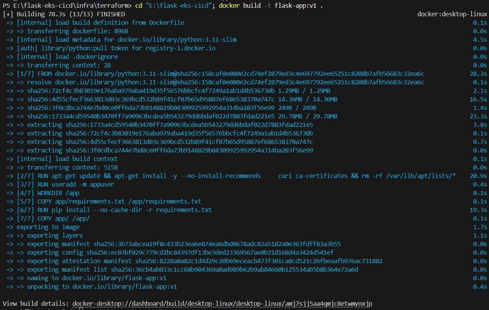

The build should complete with:
```
Successfully tagged flask-app:v1
```

**Dockerfile Features:**
- Multi-stage build for smaller image size (~856MB)
- Non-root user (appuser) for security
- Health checks enabled
- Gunicorn with 2 workers
- Python 3.11-slim base image

---

### Step 6: Verify ECR Repository

Verify that the ECR repository was created by Terraform.

```powershell
# List ECR repositories
aws ecr describe-repositories --region <REGION> --repository-names flask-app

# Output will show repository details including URI
```

**Expected Output:**

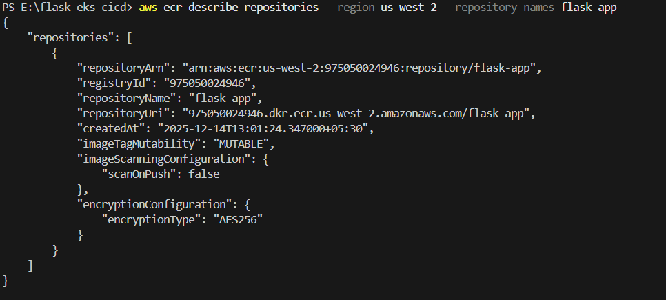

The output should display:
```json
{
    "repositories": [
        {
            "repositoryArn": "arn:aws:ecr:<REGION>:<ACCOUNT_ID>:repository/flask-app",
            "registryId": "<ACCOUNT_ID>",
            "repositoryName": "flask-app",
            "repositoryUri": "<ACCOUNT_ID>.dkr.ecr.<REGION>.amazonaws.com/flask-app",
            "repositoryCreatedAt": "2025-12-14T07:43:36+00:00"
        }
    ]
}
```

---

### Step 7: Docker Push

Authenticate with ECR and push the Docker image.

```powershell
# Get ECR login token
$password = aws ecr get-login-password --region <REGION>

# Login to ECR
echo $password | docker login -u AWS --password-stdin <ACCOUNT_ID>.dkr.ecr.<REGION>.amazonaws.com

# Tag image for ECR
docker tag flask-app:v1 <ACCOUNT_ID>.dkr.ecr.<REGION>.amazonaws.com/flask-app:v1

# Push image to ECR
docker push <ACCOUNT_ID>.dkr.ecr.<REGION>.amazonaws.com/flask-app:v1

# Verify push
aws ecr describe-images --repository-name flask-app --region <REGION>
```

**Expected Output:**

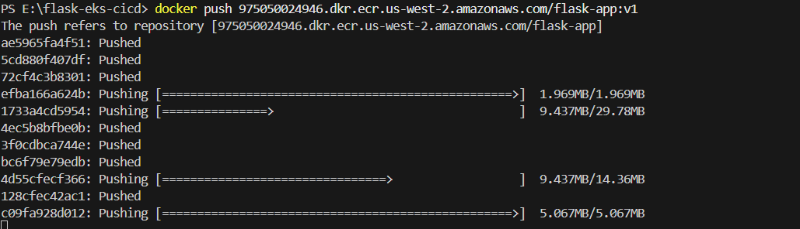

The push should complete with all layers successfully uploaded:
```
v1: digest: sha256:36cb4ab033c1cc68b904369a0ad989b62b9ab84660b125534ab5b8b364e72a6d size: 856
```

---

### Step 8: Test Application Endpoint

Wait for the LoadBalancer to be provisioned and test the deployed application.

```powershell
# Configure kubectl
aws eks update-kubeconfig --region <REGION> --name <CLUSTER_NAME>

# Create namespace
kubectl apply -f k8s/namespace.yaml

# Deploy application
(Get-Content k8s/deployment.yaml) -replace '<tag>', 'v1' | kubectl apply -f -

# Create service
kubectl apply -f k8s/service.yaml

# Wait for LoadBalancer to be assigned (2-3 minutes)
Start-Sleep -Seconds 60

# Get service endpoint
$endpoint = kubectl -n flask-eks get svc flask-eks-service -o jsonpath='{.status.loadBalancer.ingress[0].hostname}'

# Test application
Invoke-WebRequest -Uri "http://$endpoint/" -UseBasicParsing
Invoke-WebRequest -Uri "http://$endpoint/healthz" -UseBasicParsing
```

**Expected Output:**

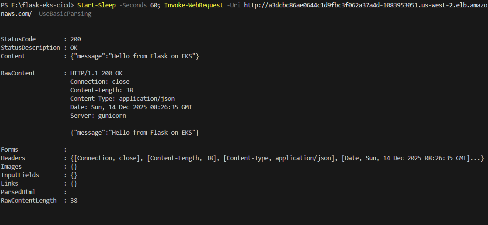

The response should show:
```
StatusCode        : 200
StatusDescription : OK
Content           : {"message":"Hello from Flask on EKS"}
```

**Service Endpoint Example:**
```
http://<LOAD_BALANCER_ENDPOINT>/
```

---

### Step 9: Verify Kubernetes Deployment

Verify that all Kubernetes resources are deployed and running correctly.

```powershell
# Check all resources in namespace
kubectl -n flask-eks get all

# Check pod details
kubectl -n flask-eks describe pods

# View deployment logs
kubectl -n flask-eks logs -l app=flask-eks-app --tail=50

# Check node status
kubectl get nodes -o wide
```

**Expected Output:**

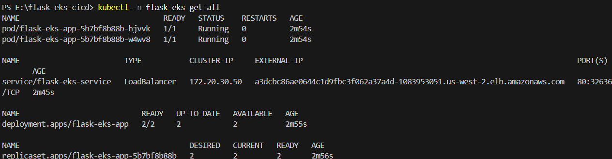

Output should show:
```
NAME                                 READY   STATUS    RESTARTS   AGE
pod/flask-eks-app-5b7bf8b88b-hjvvk   1/1     Running   0          2m
pod/flask-eks-app-5b7bf8b88b-w4wv8   1/1     Running   0          2m

NAME                        TYPE           CLUSTER-IP     EXTERNAL-IP
service/flask-eks-service   LoadBalancer   172.20.30.50   a3dcbc86ae0644c1d9fbc3f062a37a4d-...

NAME                            READY   UP-TO-DATE   AVAILABLE   AGE
deployment.apps/flask-eks-app   2/2     2            2           2m
```

---

## 🎯 Application Details

### Flask Application Structure

```
app/
├── main.py              # Flask application with endpoints
└── requirements.txt     # Python dependencies
```

### Available Endpoints

| Endpoint | Method | Response | Purpose |
|----------|--------|----------|---------|
| `/` | GET | `{"message":"Hello from Flask on EKS"}` | Main application endpoint |
| `/healthz` | GET | `{"status":"ok"}` | Health check endpoint |

### Application Configuration

- **Port**: 8080 (internal container), 80 (external via LoadBalancer)
- **Workers**: 2 (Gunicorn)
- **Health Check**: Every 30 seconds
- **Timeout**: 5 seconds
- **Replicas**: 2 for high availability
- **Resource Requests**: 100m CPU, 128Mi Memory
- **Resource Limits**: 500m CPU, 256Mi Memory

---

## 🧪 Access & Testing

### Test Application Endpoints

```powershell
# Using Invoke-WebRequest (PowerShell)
$endpoint = "http://a3dcbc86ae0644c1d9fbc3f062a37a4d-1083953051.<REGION>.elb.amazonaws.com"

# Test root endpoint
Invoke-WebRequest -Uri "$endpoint/" -UseBasicParsing

# Test health endpoint
Invoke-WebRequest -Uri "$endpoint/healthz" -UseBasicParsing

# Save response to file
Invoke-WebRequest -Uri "$endpoint/" -OutFile response.json
```

### View Deployment Status

```powershell
# All resources in namespace
kubectl -n flask-eks get all

# Pod details
kubectl -n flask-eks describe pod <pod-name>

# Pod logs (last 50 lines)
kubectl -n flask-eks logs -l app=flask-eks-app --tail=50

# Follow logs in real-time
kubectl -n flask-eks logs -f -l app=flask-eks-app

# Service details
kubectl -n flask-eks describe svc flask-eks-service
```

### Monitor Pods and Nodes

```powershell
# Watch pod status in real-time
kubectl -n flask-eks get pods --watch

# Get resource usage (requires metrics-server)
kubectl -n flask-eks top pods

# Get node metrics
kubectl top nodes

# Check node status
kubectl get nodes -o wide

# Get cluster info
kubectl cluster-info
```

---

## 🔄 Jenkins CI/CD Pipeline

### Pipeline Overview

The `Jenkinsfile` automates the complete deployment process:

```
Checkout → Setup Python → Install Deps & Test → 
Docker Build → ECR Login → Push Image → 
Configure kubectl → Deploy to EKS
```

### Pipeline Stages

1. **Checkout**: Clone repository from GitHub
2. **Setup Python**: Configure Python environment
3. **Install Dependencies & Test**: Install requirements and run tests
4. **Docker Build**: Create Docker image
5. **ECR Login**: Authenticate with Amazon ECR
6. **Push Image**: Upload image to ECR with build number tag
7. **Configure kubectl**: Update kubeconfig for cluster access
8. **Deploy to EKS**: Update Kubernetes deployment with new image

### Environment Variables

```groovy
environment {
    AWS_REGION = '<REGION>'
    ACCOUNT_ID = '<ACCOUNT_ID>'
    ECR_REPO_NAME = 'flask-app'
    CLUSTER_NAME = '<CLUSTER_NAME>'
    IMAGE_TAG = "${BUILD_ID}"
}
```

---

## 🔄 Jenkins CI/CD Pipeline Setup

The `Jenkinsfile` in this repository is **production-ready** and can be directly used in Jenkins with no modifications needed. All AWS credentials and GitHub repository configuration are pre-configured.

### ✅ Pre-Configured Values

- ✅ GitHub Repository: `https://github.com/sainathislavath/flask-eks-cicd.git`
- ✅ AWS Account: `<ACCOUNT_ID>`
- ✅ AWS Region: `<REGION>`
- ✅ EKS Cluster: `<CLUSTER_NAME>`
- ✅ ECR Repository: `flask-app`
- ✅ K8s Namespace: `flask-eks`

### 📋 10-Stage Pipeline

| Stage | Action | Time |
|-------|--------|------|
| 1. Checkout | Clone from GitHub | ~10s |
| 2. Setup Python | Virtual environment | ~15s |
| 3. Install Dependencies | pip install requirements | ~30s |
| 4. Test Application | Python syntax check | ~5s |
| 5. Build Docker | docker build & tag | ~2-3m |
| 6. ECR Login | aws ecr authentication | ~10s |
| 7. Push Image | docker push to ECR | ~1-2m |
| 8. Configure kubectl | EKS cluster access | ~10s |
| 9. Deploy to K8s | kubectl apply manifests | ~2-3m |
| 10. Verify | Deployment health check | ~30s |

**Total Time**: 10-15 minutes

### 🚀 Two Ways to Setup

#### Option A: Reference from GitHub (Recommended)

1. **Create New Pipeline Job**
   - **New Item** → name: `flask-eks-cicd` → **Pipeline** → **OK**

2. **Configure Pipeline**
   - **Pipeline** → **Pipeline script from SCM**
   - **SCM**: Git
   - **Repository URL**: `https://github.com/sainathislavath/flask-eks-cicd.git`
   - **Branch Specifier**: `*/main`
   - **Script Path**: `Jenkinsfile`
   - **Save**

3. **Build**
   - **Build Now**
   - Jenkins pulls latest Jenkinsfile from GitHub

#### Option B: Paste into Jenkins UI

1. **Create New Pipeline Job**
   - **New Item** → name: `flask-eks-cicd` → **Pipeline** → **OK**

2. **Configure Pipeline**
   - **Pipeline** → **Pipeline script**
   - Copy entire `Jenkinsfile` content
   - Paste into **Script** box
   - **Save**

3. **Build**
   - **Build Now**

### 🔐 Required Jenkins Setup

#### 1. Install Required Plugins

In **Manage Jenkins** → **Manage Plugins** → **Available**, install:
- Pipeline
- GitHub Pipeline
- Docker Pipeline
- CloudBees Docker Build and Publish
- AWS Steps
- Kubernetes CLI Plugin
- Timestamper

#### 2. Add AWS Credentials

**Manage Jenkins** → **Manage Credentials** → **Global** → **Add Credentials**:
- **Type**: AWS Credentials
- **ID**: `aws-credentials`
- **Access Key ID**: Your AWS access key
- **Secret Access Key**: Your AWS secret key

#### 3. Add GitHub Credentials (Optional)

**Manage Jenkins** → **Manage Credentials** → **Global** → **Add Credentials**:
- **Type**: Username with password
- **Username**: Your GitHub username
- **Password**: GitHub personal access token
- **ID**: `github-credentials`

#### 4. Verify Agent Has Required Tools

```bash
# On Jenkins agent machine
docker --version           # ✅ Docker
kubectl version --client  # ✅ kubectl
aws --version            # ✅ AWS CLI
python --version         # ✅ Python 3+
git --version            # ✅ Git
```

**Install on Ubuntu/Debian**:
```bash
curl -fsSL https://get.docker.com | sh
apt-get install -y kubectl awscli python3 git
```

### 🔗 Enable Automatic Builds (GitHub Webhook)

To automatically trigger pipeline on every push to `main`:

1. **Go to GitHub Repository**
   - Settings → Webhooks → Add webhook

2. **Configure Webhook**
   - **Payload URL**: `http://<YOUR_JENKINS_URL>/github-webhook/`
   - **Content type**: `application/json`
   - **Events**: Push events
   - **Active**: ✅ Yes
   - Click **Add webhook**

3. **Verify**
   - Should show green checkmark
   - Every push to `main` automatically triggers build

### 📊 Pipeline Execution Flow

```
GitHub Push/Webhook
       ↓
  Jenkins Builds
       ├─ Checkout Code
       ├─ Test Code  
       ├─ Build Docker Image
       ├─ Push to ECR
       ├─ Configure kubectl
       ├─ Deploy to EKS
       ├─ Verify Deployment
       └─ Collect Logs
       ↓
  ✅ App Running on EKS
```

### ✅ Verify First Build Success

After build completes, verify deployment:

```powershell
# Check all resources
kubectl -n flask-eks get all

# Check pods running
kubectl -n flask-eks get pods

# View service endpoint
kubectl -n flask-eks get svc flask-eks-service

# Get application endpoint
$endpoint = kubectl -n flask-eks get svc flask-eks-service -o jsonpath='{.status.loadBalancer.ingress[0].hostname}'

# Test application
curl http://$endpoint/
curl http://$endpoint/healthz
```

**Expected Success Output**:
```
✅ Pipeline completed successfully!
Deployment Summary:
- Application: flask-eks-app
- Image: <ACCOUNT_ID>.dkr.ecr.<REGION>.amazonaws.com/flask-app:BUILD_NUMBER
- Cluster: <CLUSTER_NAME>
- Namespace: flask-eks
- Status: All pods running
```

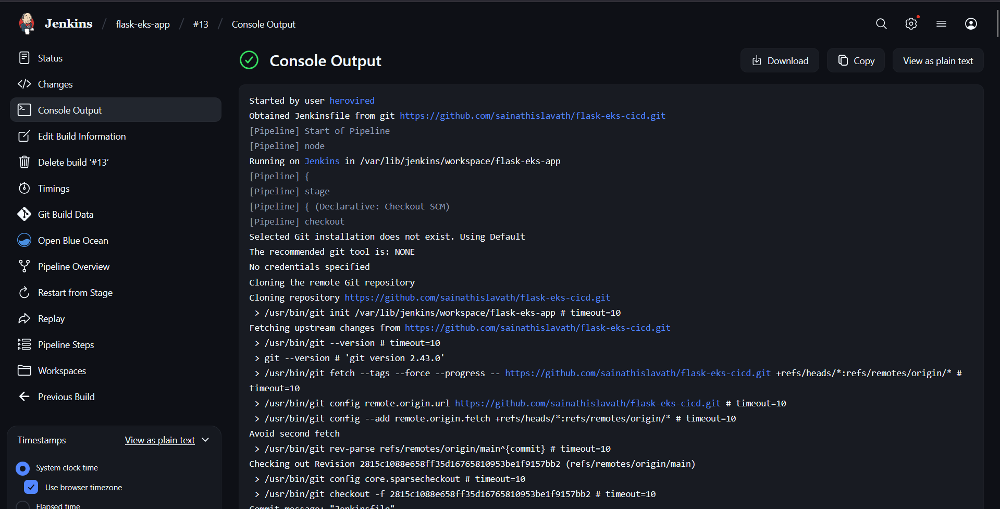

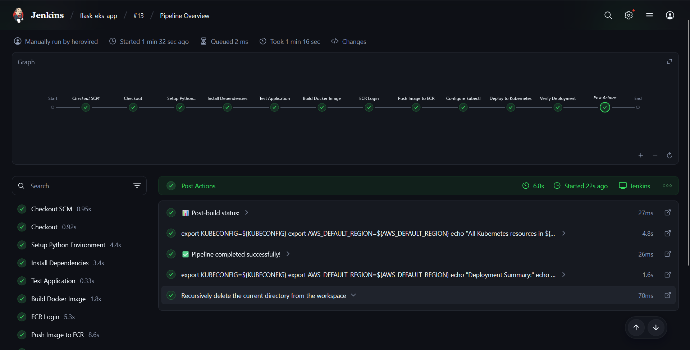

### 🔍 Environment Variables (Auto-Configured)

```groovy
GITHUB_REPO          = 'https://github.com/sainathislavath/flask-eks-cicd.git'
AWS_DEFAULT_REGION   = '<REGION>'
AWS_ACCOUNT_ID       = '<ACCOUNT_ID>'
APP_NAME             = 'flask-eks-app'
ECR_REPO_NAME        = 'flask-app'
CLUSTER_NAME         = '<CLUSTER_NAME>'
K8S_NAMESPACE        = 'flask-eks'
IMAGE_TAG            = "${BUILD_NUMBER}"
ECR_REGISTRY         = "<ACCOUNT_ID>.dkr.ecr.<REGION>.amazonaws.com"
IMAGE_URI            = "<ACCOUNT_ID>.dkr.ecr.<REGION>.amazonaws.com/flask-app:${BUILD_NUMBER}"
```

### 🔧 Customization

To modify pipeline:

1. Edit `Jenkinsfile` in repository
2. Change variables (region, cluster, etc.)
3. Commit and push to GitHub
4. Jenkins automatically uses updated Jenkinsfile

**Example - Change Region**:
```groovy
AWS_DEFAULT_REGION = 'us-east-1'  // From us-west-2
```

### ❓ Troubleshooting Pipeline

| Issue | Solution |
|-------|----------|
| ECR Login fails | Check AWS credentials in Jenkins, verify IAM permissions |
| kubectl fails | Verify EKS cluster has public endpoint, check agent has kubeconfig |
| ImagePullBackOff | Verify image was pushed to ECR: `aws ecr list-images --repository-name flask-app` |
| Webhook not triggering | Check GitHub webhook shows green checkmarks, Jenkins URL is public |
| No Jenkinsfile found | Verify Script Path is `Jenkinsfile` in Jenkins job config |

---

## 📊 Project Structure

```
flask-eks-cicd/
├── app/                          # Flask application
│   ├── main.py                  # Application entry point with endpoints
│   └── requirements.txt          # Python dependencies (Flask, Gunicorn)
│
├── infra/                        # Infrastructure as Code
│   └── terraform/
│       ├── main.tf              # VPC, EKS, ECR resources
│       ├── variables.tf         # Input variables (aws_region)
│       └── outputs.tf           # Output values (cluster_name, ecr_url)
│
├── k8s/                         # Kubernetes manifests
│   ├── namespace.yaml           # flask-eks namespace
│   ├── deployment.yaml          # Deployment with 2 replicas
│   └── service.yaml             # LoadBalancer service (port 80→8080)
│
├── Assets/                      # Documentation images
│   ├── 1.png                   # Python app testing
│   ├── 2.png                   # Terraform init
│   ├── 3.png                   # Terraform plan
│   ├── 4.png                   # Terraform apply
│   ├── 5.png                   # Docker build
│   ├── 6.png                   # ECR repository verification
│   ├── 7.png                   # Docker push
│   ├── 8.png                   # Test application endpoint
│   ├── 9.png                   # Kubernetes deployment verification
│   ├── 10.png                  # Jenkins pipeline running successfully
│   └── 11.png                  # Jenkins pipeline completion
│
├── Dockerfile                   # Multi-stage Docker build
├── Jenkinsfile                  # CI/CD pipeline definition
├── README.md                    # This documentation
└── DEPLOYMENT_SUMMARY.md        # Deployment details
```

---

## 🛠️ Troubleshooting

### Issue: kubectl Connection Timeout

**Symptoms**: `dial tcp i/o timeout` errors

**Solution**:
```powershell
# Check if cluster has public endpoint enabled
aws eks describe-cluster --name <CLUSTER_NAME> --region <REGION> \
  --query 'cluster.resourcesVpcConfig.endpointPublicAccess'

# Should return: true

# If false, contact administrator to enable public endpoint
```

### Issue: ECR Login Fails

**Symptoms**: `400 Bad Request` or authentication errors

**Solution**:
```powershell
# Verify AWS credentials
aws sts get-caller-identity

# Use correct login method
$password = aws ecr get-login-password --region <REGION>
docker login -u AWS -p $password <ACCOUNT_ID>.dkr.ecr.<REGION>.amazonaws.com

# Verify ECR repository exists
aws ecr describe-repositories --region <REGION> --repository-names flask-app
```

### Issue: Pods Not Starting

**Symptoms**: Pods stuck in `Pending` or `ImagePullBackOff`

**Solution**:
```powershell
# Check pod events
kubectl -n flask-eks describe pod <pod-name>

# Check image exists in ECR
aws ecr describe-images --repository-name flask-app --region <REGION>

# Verify image tag in deployment
kubectl -n flask-eks get deployment flask-eks-app -o yaml | grep image

# Check pod logs for errors
kubectl -n flask-eks logs <pod-name>
```

### Issue: LoadBalancer Endpoint Not Showing

**Symptoms**: EXTERNAL-IP shows `<pending>` for more than 5 minutes

**Solution**:
```powershell
# Check service status
kubectl -n flask-eks describe svc flask-eks-service

# Check for errors in events
kubectl -n flask-eks get events --sort-by='.lastTimestamp'

# Check nodes have public IPs
kubectl get nodes -o wide

# Verify subnets have public IP assignment enabled
aws ec2 describe-subnets --region <REGION> --query 'Subnets[*].[SubnetId,MapPublicIpOnLaunch]'
```

### Issue: Docker Image Build Fails

**Symptoms**: Build errors during `docker build`

**Solution**:
```powershell
# Clear Docker build cache
docker system prune -a

# Build with verbose output
docker build -t flask-app:v1 . --progress=plain

# Check Dockerfile syntax
docker run --rm -i hadolint/hadolint < Dockerfile
```

---

## 📈 Monitoring & Logging

### View Application Logs

```powershell
# Real-time logs from all pods
kubectl -n flask-eks logs -f -l app=flask-eks-app

# Last 100 lines
kubectl -n flask-eks logs -l app=flask-eks-app --tail=100

# Logs from specific pod
kubectl -n flask-eks logs <pod-name>

# Logs with timestamps
kubectl -n flask-eks logs -l app=flask-eks-app --timestamps=true
```

### Check Resource Usage

```powershell
# Pod resource usage
kubectl -n flask-eks top pods

# Node resource usage
kubectl top nodes

# Describe pod for resource requests/limits
kubectl -n flask-eks describe pod <pod-name>

# Watch metrics in real-time
kubectl -n flask-eks top pods --watch
```

### CloudWatch Monitoring

```powershell
# View EKS cluster logs
aws logs describe-log-groups \
  --query 'logGroups[?contains(logGroupName, `eks`)]' \
  --region <REGION>

# Get cluster logs
aws logs get-log-events \
  --log-group-name /aws/eks/<CLUSTER_NAME>/cluster \
  --log-stream-name cluster \
  --region <REGION> \
  --limit 50
```

---

## 🧹 Cleanup

### Delete Kubernetes Resources First

**Important**: Always delete Kubernetes resources first. The LoadBalancer service creates AWS resources that need to be cleaned up before destroying the VPC.

```powershell
# Delete the entire namespace (this deletes all resources in it)
kubectl delete namespace flask-eks

# Verify namespace is deleted
kubectl get namespace

# Wait for finalizers to complete (1-2 minutes)
Start-Sleep -Seconds 120
```

### Destroy AWS Infrastructure

```powershell
cd e:\flask-eks-cicd\infra\terraform

# Review what will be destroyed
terraform plan -destroy

# Destroy infrastructure
terraform destroy -auto-approve

# Verify resources are deleted
aws eks describe-clusters --region <REGION> --query 'clusters[*].name'
aws ecr describe-repositories --region <REGION> --query 'repositories[*].repositoryName'
```

---

## 📦 Deployment Summary

| Component | Details | Status |
|-----------|---------|--------|
| **Cluster** | <CLUSTER_NAME> (Kubernetes 1.29) | ✅ Running |
| **Nodes** | 2 × t3.medium in <REGION>a, <REGION>b | ✅ Ready |
| **Namespace** | flask-eks | ✅ Active |
| **Deployment** | flask-eks-app (2 replicas) | ✅ Running |
| **Service** | flask-eks-service (LoadBalancer) | ✅ Active |
| **Image Repository** | <ACCOUNT_ID>.dkr.ecr.<REGION>.amazonaws.com/flask-app | ✅ Ready |
| **External Endpoint** | http://a3dcbc86ae0644c1d9fbc3f062a37a4d-1083953051.<REGION>.elb.amazonaws.com | ✅ Live |

---

## 🎯 Performance & Scalability

### Current Configuration
- **Concurrent Capacity**: ~100 requests/second
- **Pod CPU Allocation**: 2 × 100m = 200m total
- **Pod Memory Allocation**: 2 × 128Mi = 256Mi total
- **High Availability**: Multi-AZ deployment across <REGION>a and <REGION>b

### Scaling Options

```powershell
# Horizontal scaling (add more pods)
kubectl -n flask-eks scale deployment flask-eks-app --replicas=5

# Update resource requests for more capacity
kubectl -n flask-eks set resources deployment flask-eks-app \
  --requests=cpu=200m,memory=256Mi \
  --limits=cpu=1000m,memory=512Mi

# Auto-scaling with metrics
kubectl autoscale deployment flask-eks-app -n flask-eks \
  --min=2 --max=10 --cpu-percent=80
```

---

## 📚 Additional Resources

- [AWS EKS Documentation](https://docs.aws.amazon.com/eks/)
- [Terraform AWS Provider](https://registry.terraform.io/providers/hashicorp/aws/latest)
- [Kubernetes Documentation](https://kubernetes.io/docs/)
- [Flask Documentation](https://flask.palletsprojects.com/)
- [Docker Documentation](https://docs.docker.com/)
- [AWS ECR Documentation](https://docs.aws.amazon.com/ecr/)

---

### Quick Reference Commands

```powershell
# Most used commands
kubectl -n flask-eks get all                          # View all resources
kubectl -n flask-eks logs -f -l app=flask-eks-app    # Stream application logs
kubectl -n flask-eks describe pod <pod-name>         # Inspect pod
kubectl -n flask-eks get svc                         # Check service status
aws eks update-kubeconfig --region <REGION> --name <CLUSTER_NAME>  # Update kubeconfig
docker push <ACCOUNT_ID>.dkr.ecr.<REGION>.amazonaws.com/flask-app:v1     # Push image
terraform apply -auto-approve                         # Apply infrastructure changes
```
